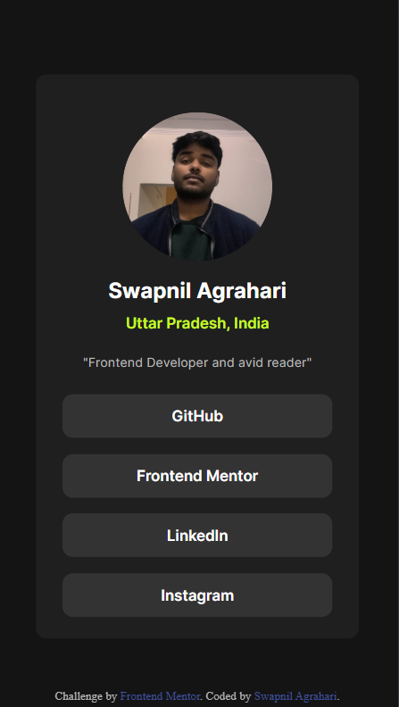

# Frontend Mentor — Social Links Profile

## 📌 Overview

This is a solution to the [Social Links Profile challenge on Frontend Mentor](https://www.frontendmentor.io/challenges/social-links-profile-UG32l9m6dQ).

---

## 🔗 Links

- **Github Repo Link:** [https://ag-swapnil1.github.io/social-links-profile](https://ag-swapnil1.github.io/social-links-profile)

---

## 📸 Screenshots

**Desktop:**


**Mobile:**


---

## 🛠️ Built With

- Semantic HTML5 markup
- CSS custom properties
- Flexbox
- CSS transitions & hover effects
- Custom web font (Inter)
- Desktop-first workflow

---

## 📁 Project Structure

```
social-links-profile/
├── index.html              # Main HTML entry point
├── css/
│   └── style.css           # Main stylesheet
└── assets/
│    ├── images/
│    │   ├── favicon-32x32.png
│    │   └── swapnil-agrahari.png
│    └── fonts/
│       └── Inter-VariableFont_slnt,wght.ttf
├── docs/
│   ├── desktop-preview.png
│   └── mobile-preview.png
├── .github/
│   └── workflows/
│       └── deploy.yml
├── .gitignore
├── LICENSE
└── README.md
```

---

## 💡 What I Learned

- Using `@font-face` to load custom local fonts
- CSS hover transitions for interactive button effects
- Building a clean card layout with Flexbox
- Structuring accessible social link buttons

---

## 🚀 Getting Started

```bash
git clone https://github.com/ag-swapnil1/social-links-profile.git
cd social-links-profile
open src/index.html
```

No build tools required — pure HTML & CSS.

---

## 👤 Author

- **GitHub:** [@ag-swapnil1](https://github.com/ag-swapnil1)
- **Frontend Mentor:** [@ag-swapnil1](https://www.frontendmentor.io/profile/ag-swapnil1)

---

## 📄 License

Open source under the [MIT License](./LICENSE).
